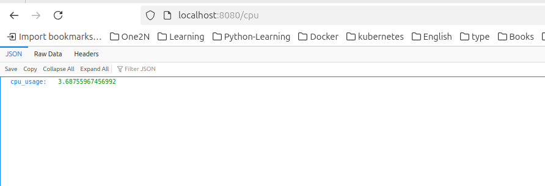

## 1. Project Title
  
Create a Go project to get the system CPU usages, CPU load and system uptime.

## 2. Project Description
  
This project runs on GO language using Docker, leveraging multi-stage builds to minimize the image size and deploy on the azure server. 

## 3. Prerequisites
  
- Docker
- Go language
- Make
- 
## 4. Setup & configuration
  
 ```
 # Clone the repository
 git clone https://github.com/rajeshecb70/go-project.git
 cd go-project/
 ```

 ```
 # Target to Check version. (must installed go in system)
 make version
 ```

 ```
 # Target to Install dependencies
 make install
 ```

 ```
 # Target to check linting
 make lint
 ```

 ```
 # Target to run tests
 make test
 ```

 ```
 # Target to create build
 make build
 ```

 ```
 # Target to  build docker image
 make docker-build
 ```

 ```
 # Target to login in docker
 make docker-login
 ```

 ```
 # Target to push the docker image in docker hub
 make docker-push
 ```

 ```
 # Target to run the service
 make docker-run
 ```

 ```
 # Target to clean the temporary files.
 make full_clean
 ```

### 5. Expectations
  
- The following expectations should be met to complete this project.
  -  Proper tagging to docker image.✅
  - Makefile should have all targets as below.
    - To check version.✅
    - To install go dependencies.✅
    - To check code linting.✅
    - To run the test.✅
    - To build the project.✅
    - To build the docker image.✅
    - To push the artifact to docker artifactory.✅
    - To run the docker image.✅
  - README.md file should be updated with instructions
    - To add pre-requisites for any existing tools that must already be installed (e.g., docker, make, etc)✅
    - To run different make targets and the order of execution.✅
  
  ### 6. Accessing the Application
  - application end-points:
    - CPU usages: http://localhost:8080/cpu ✅
    - System uptime: http://localhost:8080/uptime ✅
    - System Load: http://localhost:8080/load ✅

  ### 7. Snapshots
  - CPU usages: 
  - System Load: 
  - System uptime: 